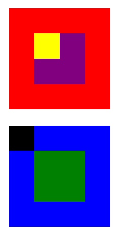

# Posicionando cajas

## Introducción
El presente trabajo consiste en replicar la siguiente imagen poniendo en práctica los conocimientos de positioning.

## Contenido de las carpetas
Se tienen dos carpetas principales, la primera llamada assets, donde se aloja una carpeta adicional llamada images. En la carpeta images se almacena la imagen "cuadrados" utilizado en este Readme. La segunda carpeta llamada css, donde se almacena el archivo main.css usado para dar estilo y diseño a la página web.